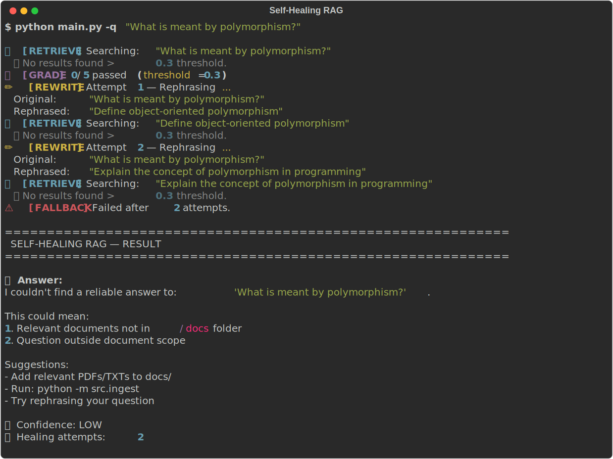

# Self-Healing RAG System


A production-ready Retrieval-Augmented Generation system using LangGraph + Groq + JSON Vector Store with self-correction loop. The LLM grades its own answers and autonomously retries when quality thresholds fail.

## Core Concept

> "RAG systems don't know when they're wrong. The fix is to make the LLM grade itself. After generating an answer, ask: Is this actually supported by the retrieved documents? No → rewrite the question → try again. Still no → honest I don't know."

## Demo


## Tech Stack

| Component | Technology |
|-----------|-----------|
| Language | Python 3.10+ |
| LLM | Groq (llama-3.1-8b-instant) |
| Embeddings | sentence-transformers (all-MiniLM-L6-v2) |
| Vector Store | JSON Vector Store (Pure Python) |
| Workflow | LangGraph StateGraph |
| Document Loaders | langchain-community (PDF + TXT) |

## Architecture Flow

```
User Query
    ↓
retrieve (JSON store similarity search)
    ↓
grade_documents (relevance > 0.3?)
    ↓ YES          ↓ NO
generate      rewrite_query ←─────────────┐
    ↓                              │
grade_answer (supported by context?)    │
    ↓ YES    ↓ NO                  │
finish   rewrite_query             │
         └──────────────────────────┘
         (max 2 retries → fallback)
```

## Quick Start

```bash
# 1. Install dependencies
pip install -r requirements.txt

# 2. Add Groq API key
echo "GROQ_API_KEY=your_key_here" > .env
# Get free key at: https://console.groq.com/keys

# 3. Add documents to docs/ folder
cp yourfile.pdf docs/

# 4. Run ingestion
python src/ingest.py

# 5. Ask questions
python main.py
```

## Usage

```bash
# Interactive mode
python main.py

# Single question mode  
python main.py -q "What is RAG?"

# Health check
python scripts/health_check.py
```

## Project Structure

```
self-healing-rag/
├── .env                    # GROQ_API_KEY
├── requirements.txt
├── main.py                 # CLI entry point
├── src/
│   ├── state.py           # GraphState TypedDict
│   ├── utils.py          # Helpers (cosine similarity + logger)
│   ├── config.py         # Configuration variables
│   ├── ingest.py        # Document → JSON Store pipeline
│   ├── nodes.py        # 7 LangGraph nodes
│   └── graph.py        # StateGraph builder
├── scripts/
│   └── health_check.py  # System health check script
├── docs/                # Drop PDFs/TXTs here
└── vectorstore/          # JSON vector store persists here
```

## Features

| Feature | Description |
|---------|-------------|
| **Self-Healing** | LLM grades answer, retries if fails |
| **Two Quality Gates** | Document relevance + answer support |
| **Query Rewriting** | Different rewrite each attempt |
| **Confidence Scoring** | HIGH/MEDIUM/LOW based on retries |
| **Proper Sources** | Filename + chunk number displayed |
| **Healing Logs** | Audit trail in logs/healing_log.json |
| **Graceful Fallback** | Clear error messages |

## Example Usage

```
$ python main.py
🧬 SELF-HEALING RAG SYSTEM
LangGraph + Groq + JSON Vector Store

Commands:
  • Type a question
  • 'quit' to exit
  • 'ingest' to re-index

💬 Your question: What is RAG?

🔍 [RETRIEVE] Found 5 chunks
📊 [GRADE] 5/5 passed
🤖 [GENERATE] Building...
✅ [GRADE_ANSWER] YES → PASS
🏁 [FINISH] Confidence: HIGH

📝  Answer:
Retrieval-Augmented Generation (RAG) is an AI technique that combines information retrieval with text generation.

🟢  Confidence: HIGH
✅  Healing: Not needed (first try)

📚  Sources (5 chunks):
   1. sample_rag_concepts.txt — chunk #0 (relevance: 0.638)
   2. sample_rag_concepts.txt — chunk #1 (relevance: 0.462)
```

## Testing

```bash
# Test direct answer
python main.py
# Type: "What is RAG?" → Expected: HIGH confidence

# Test out-of-scope
# Type: "What is the capital of France?" → LOW + fallback

# Test healing needed
# Type: "How does this work?" → MEDIUM + healing
```

## Getting Help

- Add issues at: https://github.com/glorin05/self-healing-rag/issues
- Groq API keys: https://console.groq.com/keys

## Built by
**Glorin P P** — CS Student, KMEA Engineering College  
[LinkedIn](https://linkedin.com/in/glorin-pp) | [GitHub](https://github.com/glorin05)

## License

MIT